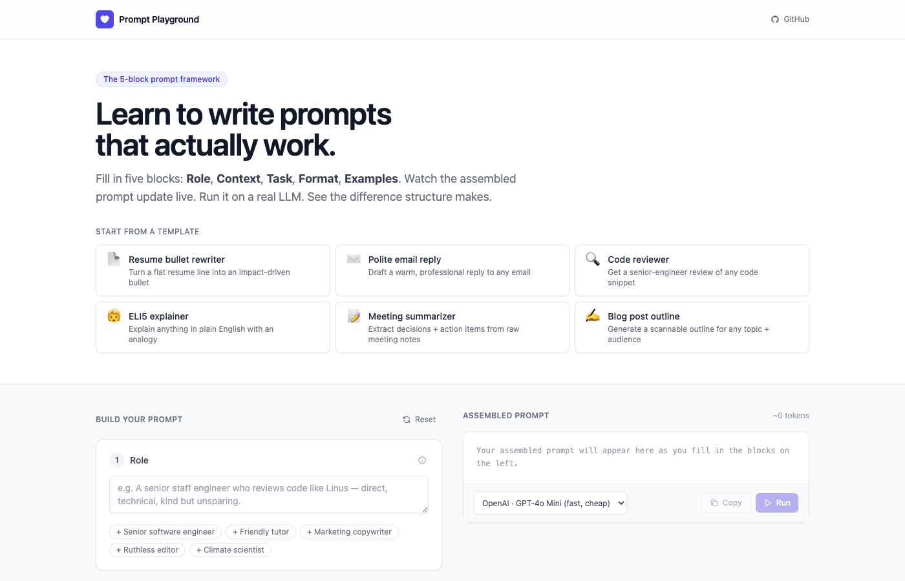

# 🧠 Prompt Playground

**An interactive tool for learning and experimenting with prompt engineering in real time.**

Built to make prompt engineering tangible — not just theory. You fill in five structured blocks, watch your prompt assemble live, and run it against a real LLM to see exactly how phrasing, context, constraints, examples, and output format change the response.



---

## What it does

Most people treat prompts like search queries. This tool shows why that's wrong.

The **5-block framework** (Role → Context → Task → Format → Examples) teaches users to build prompts the way experienced engineers do — structured, intentional, and testable. Every change you make updates the assembled prompt live, so you can see the cause and effect instantly.

- **Beginners** learn what makes a good prompt by experimenting and observing
- **Developers** use it to iterate quickly on prompts before integrating into their apps

---

## Features

| Feature | Description |
|---|---|
| 5-block prompt builder | Role, Context, Task, Format, Examples — each with inline explanation of why it matters |
| Live prompt assembly | Assembled prompt updates as you type with a real-time token estimate |
| Streaming responses | LLM output streams token-by-token — no waiting for the full response |
| 6 built-in templates | Resume rewriter, Code reviewer, ELI5 explainer, Email reply, Meeting summarizer, Blog outline |
| Multi-model support | GPT-4o Mini (default), GPT-4o, Claude 3 Haiku, Claude 3.5 Sonnet, Gemini 2.0 Flash |
| One-click copy | Copy the assembled prompt to paste anywhere |

---

## Tech stack

| Layer | Technology |
|---|---|
| Backend | Python 3 · Flask |
| AI | OpenAI Python SDK → OpenRouter API |
| Frontend | HTML · Tailwind CSS (CDN) · Vanilla JS |

No build step. No framework overhead. Just Python and a single HTML file.

---

## Run locally

```bash
# 1. Clone
git clone https://github.com/dabhiram13/Prompt-Playground-Application.git
cd Prompt-Playground-Application

# 2. Create virtualenv and install deps
python3 -m venv venv
source venv/bin/activate
pip install -r requirements.txt

# 3. Add your API key (free at openrouter.ai/keys)
cp .env.example .env
# Open .env and set OPENROUTER_API_KEY=your_key

# 4. Start
python3 app.py
```

Open **http://localhost:3000**

---

## Project structure

```
prompt-playground/
├── app.py               # Flask backend — routes + OpenRouter streaming
├── templates/
│   └── index.html       # Full UI — Tailwind + vanilla JS, no build step
├── requirements.txt     # flask, openai, python-dotenv
├── .env.example         # Environment variable template
└── docs/
    └── screenshot.png   # App preview
```

---

## Environment variables

| Variable | Required | Where to get it |
|---|---|---|
| `OPENROUTER_API_KEY` | ✅ | [openrouter.ai/keys](https://openrouter.ai/keys) — free credits included |

---

*Built with Python · Flask · OpenRouter · MIT License*
