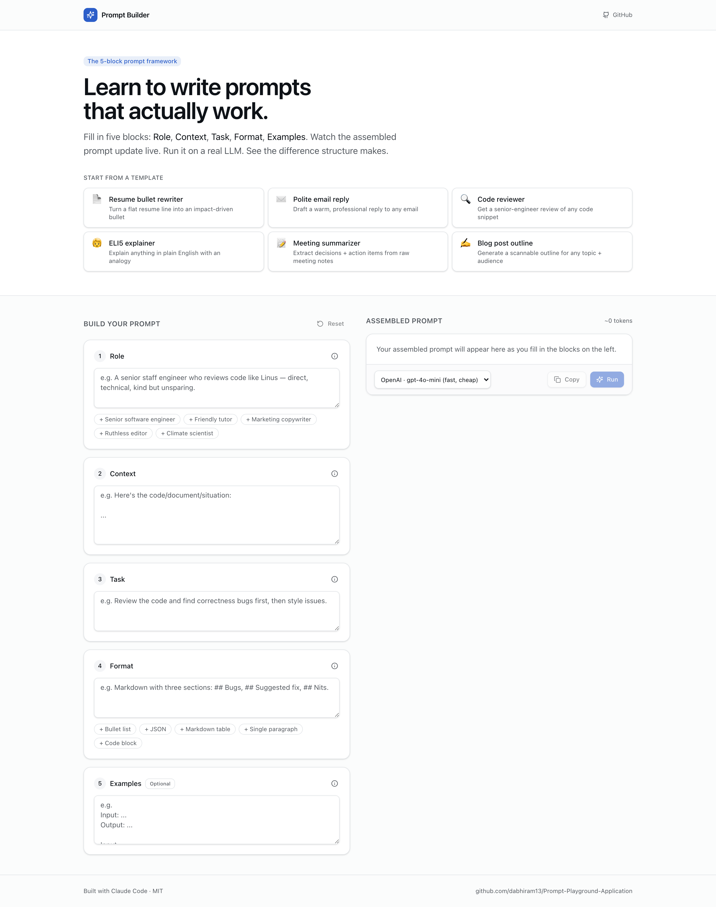
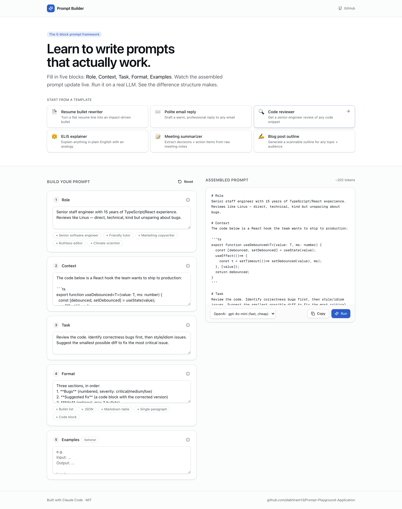

# Prompt Builder

**Learn to write prompts that actually work.** An interactive playground that teaches the 5 building blocks of a great AI prompt — and runs your prompt on a real LLM so you see the difference structure makes.

Built with [Claude Code](https://claude.com/claude-code) as an AI-assisted prototype. Fork it, add one API key, ship your own.



Same wizard with the **Code reviewer** template loaded — see the assembled prompt update live on the right:



---

## The 5-block framework

Most "prompt engineering" advice is vague. This playground forces you to fill in five concrete blocks:

| Block      | What it does                                                                 |
| ---------- | ---------------------------------------------------------------------------- |
| **Role**   | Tells the model who to be. Sets tone, vocabulary, and authority.             |
| **Context**| Everything the model needs to know but can't infer.                          |
| **Task**   | The actual ask, specific enough that "vague" isn't an option.                |
| **Format** | How the answer should be structured — bullets, JSON, table, code block.      |
| **Examples**| Optional. Show what "good" looks like in your domain.                       |

Fill in the blocks. Watch the assembled prompt update live. Hit **Run**. Compare it to writing a one-line prompt and you'll see why the framework matters.

## Quickstart

```bash
git clone https://github.com/dabhiram13/Prompt-Playground-Application.git
cd Prompt-Playground-Application
cp .env.example .env.local       # add your AI_GATEWAY_API_KEY
npm install
npm run dev
```

Open <http://localhost:3000>.

That's it. One env var, no database, no auth.

## Get your API key

Grab a free `AI_GATEWAY_API_KEY` from [vercel.com/ai-gateway](https://vercel.com/ai-gateway). The gateway routes to OpenAI, Anthropic, Google, Mistral, and more — pick whichever model you want from the in-app dropdown.

## What's inside

- 6 starter templates beginners can load with one click (resume bullet rewriter, polite email reply, code reviewer, ELI5 explainer, meeting summarizer, blog post outline)
- Live assembled-prompt panel — see exactly what gets sent to the model
- Token estimate so you learn what verbose prompts cost
- Streaming responses from any LLM via [Vercel AI Gateway](https://vercel.com/ai-gateway)
- Suggestion chips on Role and Format blocks (skip the blank-page problem)

## Deploy

One-click to Vercel:

[](https://vercel.com/new/clone?repository-url=https%3A%2F%2Fgithub.com%2Fdabhiram13%2FPrompt-Playground-Application&env=AI_GATEWAY_API_KEY&envDescription=Get%20your%20key%20at%20vercel.com%2Fai-gateway)

## Stack

- [Next.js 16](https://nextjs.org) (App Router)
- [Tailwind CSS v4](https://tailwindcss.com) + Notion-inspired design tokens
- [shadcn/ui](https://ui.shadcn.com) primitives (Button, Textarea, Input, Label, Badge, Tooltip)
- [AI SDK v6](https://ai-sdk.dev) + [Vercel AI Gateway](https://vercel.com/ai-gateway)
- [Zod](https://zod.dev) for input validation
- TypeScript

## Project structure

```
app/
  page.tsx              the wizard (client component)
  api/run/route.ts      streaming endpoint (server)
  layout.tsx            root layout
  globals.css           Tailwind v4 + Notion-style tokens
components/ui/          minimal shadcn primitives
lib/
  utils.ts              cn() helper
  templates.ts          the 5-block schema + 6 starter templates
```

## Ideas to fork-and-extend

- **History**: persist runs in localStorage so users can revisit past prompts
- **Side-by-side compare**: run the same blocks on two models, diff the outputs
- **Share links**: encode the blocks in the URL so users can share prompts
- **Block reordering**: let users move/disable blocks (e.g. drop Examples)
- **Cost calculator**: show estimated $ cost per run based on model + tokens
- **Auth + saved templates**: add Clerk / NextAuth so users build their own template library

## License

MIT. Fork it. Teach someone.
