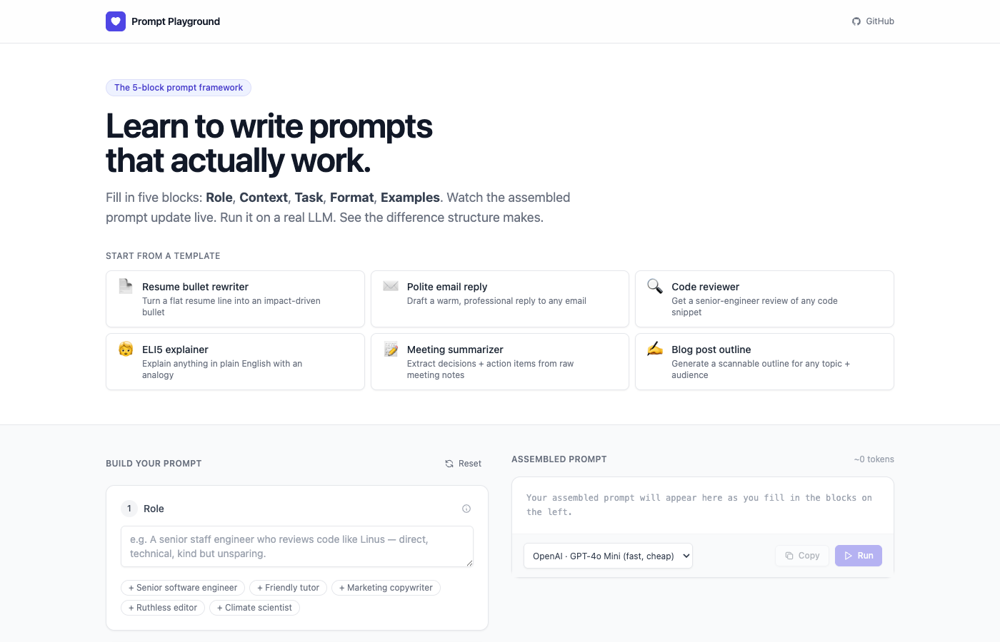

# ⚡ Prompt Studio

**Learn prompt engineering by proving what works — then ship your prompt as a real tool. All on free models: $0.**

Most prompt advice is tips you have to take on faith. Prompt Studio is built on a different idea: **evidence**. Build a prompt from five blocks, run side-by-side experiments that show exactly why one version beats another, grade versions against your own checklist, and publish the winner as a link anyone can use — no account, no API key, no cost.



---

## The loop: Learn → Build → Prove → Ship

| Stage | What you do | What you walk away with |
|---|---|---|
| **Learn** | Browse cached prompt pairs where one block changes — spot why B beats A | Intuition for the 5-block framework, at zero API cost |
| **Build** | Fill Role / Context / Task / Format / Examples; use `{{variables}}` for the parts that change | A structured, reusable prompt — not a chat one-liner |
| **Prove** | One-click ablation ("what if removed?"), A/B runs across models, AI verdict card, pass/fail checklists, version diffs | Evidence your v3 beats your v1, on your own real inputs |
| **Ship** | Publish as `/t/your-app` — a mini-app with fill-in fields; or export as Python/JS code | A working tool your friends can use, and remix |

## Why it costs $0

- **Free OpenRouter models by default** — the model menu is a curated list of `:free` models (GPT-OSS 120B, Llama 3.3 70B, Qwen3 Coder, Gemma 4…). You need an [OpenRouter key](https://openrouter.ai/keys) (free to create), but these models bill nothing.
- **Local Ollama auto-detected** — if Ollama is running, your local models appear in the menu. No key at all.
- **The Learn gallery is fully cached** — browsing lessons makes zero API calls.
- Paid models exist behind an explicit `ALLOW_PAID_MODELS=1` opt-in, with a "PAID" warning in the cost line.

## Features

- **5-block builder** with live prompt assembly, token estimate, and inline "why this block matters"
- **A/B compare** — two variants, two models if you want, streamed side by side
- **One-click ablation** — "same prompt, minus Examples" → instant experiment
- **Verdict card** — a free judge model compares outputs against a fixed rubric; always labeled as opinion, shown only after both raw outputs, rubric expandable
- **Library & versions** — every saved prompt snapshots immutable versions; plain-English diffs between any two
- **`{{variables}}` + test inputs** — save real examples ("Stripe PM posting") and run any version against all of them, with a cost-confirm dialog first
- **Checklists & scorecards** — word limits and must-contains checked in Python; judgment calls via the judge model; every red cell shows *why* and is one click to override
- **Refine chips** — "shorter", "more formal" — each shows the exact block edit it makes before running. Micro-lessons.
- **Public mini-apps** — publish any version at `/t/slug`; visitors fill variables and run, no account. Rate limits, daily token budgets, input caps, and a kill switch protect you. **Remix** lets any visitor fork the prompt into their own builder.
- **Export to code** — your prompt as a ready-to-paste Python or JS function, variables as arguments.

## Tech stack

| Layer | Technology |
|---|---|
| Backend | Python 3 · Flask · stdlib `sqlite3` (WAL) |
| AI | OpenAI SDK → OpenRouter free models · optional local Ollama |
| Frontend | Jinja templates · Tailwind (CDN) · vanilla ES modules — **no build step** |

## Run locally

```bash
git clone https://github.com/dabhiram13/Prompt-Playground-Application.git
cd Prompt-Playground-Application
python3 -m venv venv && source venv/bin/activate
pip install -r requirements.txt

cp .env.example .env
# Set OPENROUTER_API_KEY (free at openrouter.ai/keys — free models cost $0)
# …or skip the key entirely and run Ollama locally.

python3 app.py
```

Open **http://localhost:3000**.

## Deploying (Railway or similar)

1. Set `OPENROUTER_API_KEY` in the environment.
2. **Mount a volume** and point `DATABASE_PATH` at it (e.g. `/data/prompt_studio.db`) — without this, user data is wiped on every redeploy.
3. Optional knobs: `PUBLIC_APP_DAILY_TOKENS`, `PUBLIC_GLOBAL_DAILY_TOKENS`, `PUBLIC_IP_MAX_REQUESTS`, and `PUBLIC_APPS_DISABLED=1` as an instant kill switch for all public mini-apps.

## Project structure

```
├── app.py                  # Flask entry — blueprints + index
├── providers.py            # $0 model layer: free OpenRouter list + Ollama autodetect
├── db.py                   # SQLite schema + data access (WAL, no ORM)
├── promptkit.py            # prompt assembly + {{variable}} handling
├── abuse.py                # rate limits, token budgets, kill switch, input caps
├── routes/
│   ├── run.py              # streaming runs + verdict judge
│   ├── library.py          # prompts, versions, test inputs, checklists
│   ├── grade.py            # checklist grading + overrides
│   └── publish.py          # public mini-apps + remix
├── templates/              # base, index (Build/Learn/Library), public_app
├── static/js/              # ES modules: builder, compare, gallery, library
└── static/data/gallery.json  # cached lessons — the zero-cost front door
```

## License

MIT
